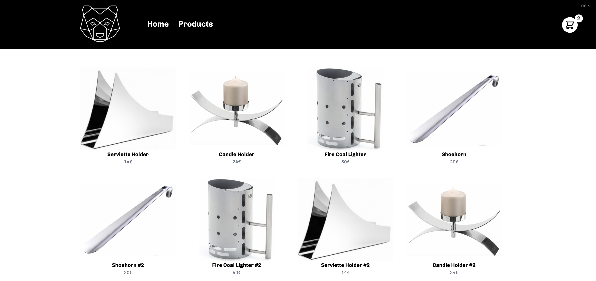

# Sveltekit Tailwind CSS Ecommerce Store

An Open Source Ecommerce Shop build with awesome [Sveltekit](https://kit.svelte.dev/) and [Tailwind CSS](https://tailwindcss.com/)


## [Check out the Demo](https://master--nimble-zabaione-e0b961.netlify.app/)  
  


# Features

- SvelteKit as js Framework (mix of SSR and SPA)
- Tailwind as css Framework
- 🚀 Superfast
- Full responsive -> in Mobile, Tablet and Web Browser Size
- Smooth and cool Animations
- Nice intuitive Cart Design
- Form Validation for shipping and billing with yup and svelte-forms-lib
- Usage of Stores and localStorage
- Carousel (Slider) for Products (visible in tablet screensize)
- i18n implementation (English and German Language available)
- Minimalistic Black and White UI Design
  
# Things that can be improved

- better coloring and layout (I am not a good UI Designer)
- payment gateway integration (paypal or stripe etc)
- headless cms integration (I tried shopify but I really disliked that you have to use their checkout page)

# Getting started

### Install and run SvelteKit with the commands below:

```bash
git clone https://github.com/martykuentzel/sveltekit-tailwind-ecommerce.git
cd sveltekit-tailwind-ecommerce
npm install
npm run dev

```
  
OR

Just ...

[](https://app.netlify.com/start/deploy?repository=https://github.com/martykuentzel/sveltekit-tailwind-ecommerce)

And that's it!
